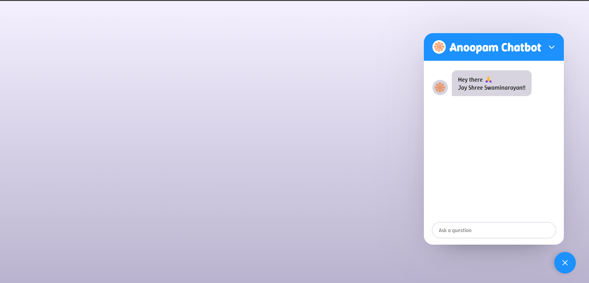
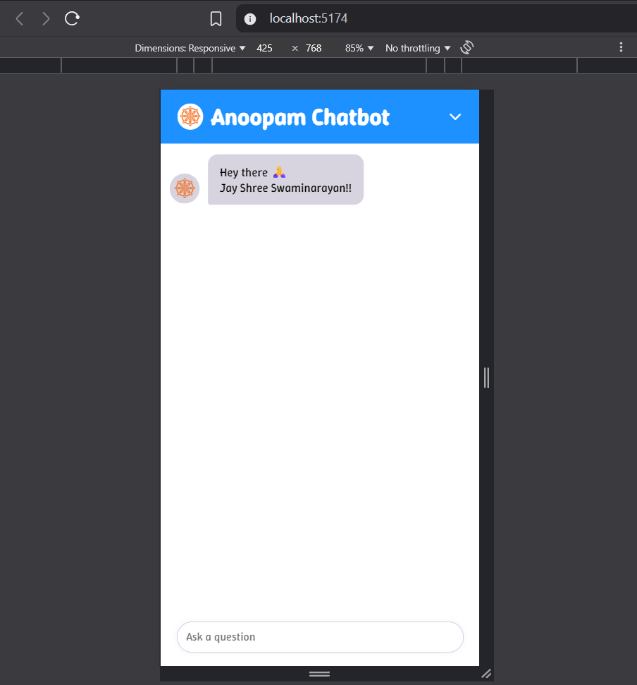

# Anoopam Chatbot

A responsive React chatbot that leverages the Google Gemini API for powerful Question Answering capabilities. This project integrates a backend server to process uploaded PDF files, extracting text to serve as dynamic context for the Gemini AI.

## Features

* **Google Gemini API Integration:** Utilizes the Gemini API for advanced natural language understanding and generation, providing intelligent responses to user queries.
* **Responsive Design:** Adapts seamlessly to different screen sizes (desktop, tablet, mobile), ensuring an optimal user experience. The chatbot expands to full screen on smaller devices, and the toggler button is hidden to prevent overlap.
* **Dynamic Context:** The chatbot can answer questions based on the content of the currently uploaded PDF, making it highly versatile for various documents.
* **User-Friendly Interface:** A clean and intuitive UI for natural and engaging conversations.

## Demo

Here are some screenshots showcasing the chatbot's functionality:

### Desktop View



### Mobile View (Full Screen)



## Technologies Used

* **Frontend (React):**
    * React.js: For building the interactive user interface.
    * Vite: A fast build tool for modern web projects.
    * CSS: For styling and responsive layouts.
* **Backend (Node.js/Express):**
    * Node.js & Express.js: For creating a robust API server.
    * `pdf-parse`: Library to extract text from PDF files.
    * `@google/generative-ai`: Google's official client library for interacting with the Gemini API.
    * `multer`: Middleware for handling file uploads (PDFs).
    * `cors`: For enabling Cross-Origin Resource Sharing.
    * `dotenv`: For managing environment variables (API keys).

## Getting Started

Follow these steps to set up and run your Anoopam Chatbot locally.

### Prerequisites

* Node.js (LTS version recommended)
* npm or yarn (for package management)
* A Google Cloud Project with the Gemini API enabled and an API Key.

### Installation

1.  **Clone the repository:**

    ```bash
    git clone [https://github.com/YOUR_USERNAME/YOUR_REPO_NAME.git](https://github.com/YOUR_USERNAME/YOUR_REPO_NAME.git)
    cd YOUR_REPO_NAME
    ```

    **(Remember to replace `YOUR_USERNAME` and `YOUR_REPO_NAME` with your actual GitHub details.)**

2.  **Frontend Setup:**
    * Navigate into the frontend project directory (your main project root).
    * Install dependencies:
        ```bash
        npm install
        # or
        yarn install
        ```
    * Create a `.env` file in the **frontend root directory** and add your backend API URL (this will be the URL where your Node.js server runs):
        ```env
        VITE_API_BASE_URL=http://localhost:3001
        ```
        (Adjust the port if your backend runs on a different one).

3.  **Backend Setup:**
    * Navigate into the `server` directory you created (or where you put your backend code):
        ```bash
        cd server
        ```
    * Install backend dependencies:
        ```bash
        npm install
        # or
        yarn install
        ```
    * Create a `.env` file in the **`server` directory** and add your Gemini API Key:
        ```env
        GEMINI_API_KEY=YOUR_GEMINI_API_KEY_HERE
        PORT=3001
        ```
        Replace `YOUR_GEMINI_API_KEY_HERE` with your actual Gemini API key.

### Running the Project

1.  **Start the Backend Server:**
    * Open a new terminal.
    * Navigate to your `server` directory:
        ```bash
        cd YOUR_REPO_NAME/server
        ```
    * Start the server:
        ```bash
        npm start
        # or
        yarn start
        ```
    * You should see a message like `Backend server listening at http://localhost:3001`.

2.  **Start the Frontend Development Server:**
    * Open another new terminal.
    * Navigate to your main project root directory (where `package.json` for React is):
        ```bash
        cd YOUR_REPO_NAME
        ```
    * Start the React app:
        ```bash
        npm run dev
        # or
        yarn dev
        ```
    * Open your browser and navigate to `http://localhost:5173` (or the port indicated in your terminal).

## Usage

1.  **Launch the Chatbot:** On desktop, click the chatbot toggler button at the bottom right of the screen. On mobile, the chatbot will automatically expand to full screen upon interaction.
2.  **Upload a PDF:** Use the "Choose File" input within the chatbot to select a PDF document. This file will be sent to your backend server for text extraction. A loading indicator will show while the PDF is being processed.
3.  **Ask Questions:** Once the PDF content is processed by the backend, type your questions related to the content of the PDF in the input field and press Enter or click the send button. Your question and the extracted context will be sent to the Gemini API via your backend.
4.  **Receive Answers:** The chatbot will provide answers generated by the Gemini API, based on the text extracted from your uploaded PDF.

## Project Structure
